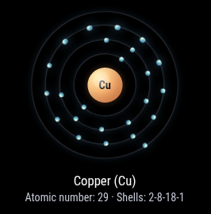

# MMM-AtomVisualizer

`MMM-AtomVisualizer` is a MagicMirror² module that renders an animated atom in a Bohr-style model. By default, it cycles through the list of all chemical elements.

## Screenshot



## Installation

```bash
cd ~/MagicMirror/modules/
git clone https://github.com/KristjanESPERANTO/MMM-AtomVisualizer
```

## Update

```bash
cd ~/MagicMirror/modules/MMM-AtomVisualizer
git pull
```

## Configuration

Add the following block to your `config.js` file and adjust the options as needed:

```js
{
  module: "MMM-AtomVisualizer",
  position: "top_right",
  config: {
    cycleElements: true,
    cycleEvery: 45,
  }
},
```

## Options

| Option                 | Type       | Default | Description                                                        |
| ---------------------- | ---------- | ------- | ------------------------------------------------------------------ |
| `element`              | `string`   | `"C"`   | Element symbol to display                                          |
| `elements`             | `string[]` | `[...]` | Element list used when `cycleElements` is enabled                  |
| `cycleElements`        | `boolean`  | `true`  | Automatically cycle through `elements`                             |
| `shuffleElements`      | `boolean`  | `true`  | Randomize element order when cycling starts (Fisher-Yates shuffle) |
| `cycleEvery`           | `number`   | `60`    | Cycle interval in seconds                                          |
| `size`                 | `number`   | `240`   | Atom size in pixels                                                |
| `nucleusScale`         | `number`   | `0.22`  | Nucleus-to-atom size ratio                                         |
| `electronSize`         | `number`   | `7`     | Electron size in pixels                                            |
| `electronSpeed`        | `number`   | `10`    | Base electron revolution duration (seconds)                        |
| `mixedOrbitDirections` | `boolean`  | `true`  | Alternate electron direction per shell for visual depth            |
| `autoRotate`           | `boolean`  | `true`  | Slowly rotate shell system                                         |
| `rotationDuration`     | `number`   | `42`    | Duration of one shell system rotation in seconds                   |
| `showLabel`            | `boolean`  | `true`  | Show element name and symbol                                       |
| `showLegend`           | `boolean`  | `true`  | Show atomic number and shell distribution                          |

## Code of Conduct

Please note that this project is released with a [Contributor Code of Conduct](CODE_OF_CONDUCT.md). By participating in this project you agree to abide by its terms.

## License

This module is licensed under the MIT License. See [LICENSE.md](LICENSE.md) for details.
